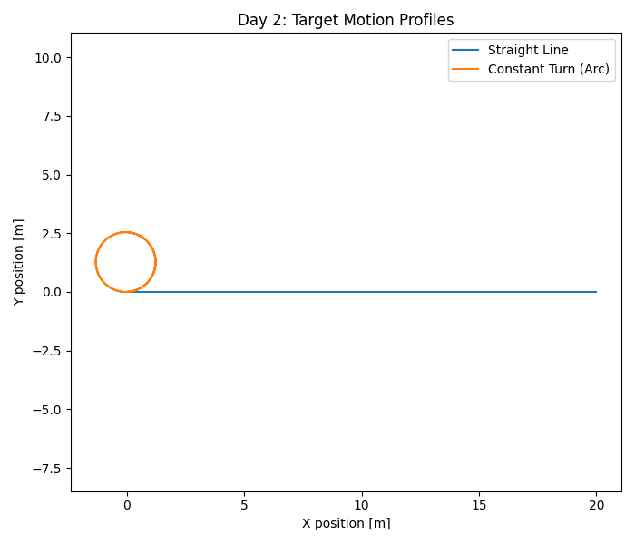

# Flight-Intercept Guidance & Control – System Sandbox

Day 1: Define sandbox, pick simulator, finalize quadrotor/environment/sensors, document in README.
## Simulator
- **Choice:** Custom Python-based ODE simulator.
- **Justification:** 
  - Rapid prototyping, transparent for G&C research.
  - Easy to inspect, modify, and debug.
  - (Optional: Can migrate to AirSim/Flightmare for richer visuals if time allows.)

## Vehicle Dynamics
- **Model:** 6-DOF rigid-body quadrotor (Newton-Euler equations).
- **Control Inputs:** Total thrust and 3-axis torques (roll, pitch, yaw).
- **Actuator Limits:** Thrust: [0, 40 N], Torques: ±1 Nm per axis.
- **Actuator Dynamics:** First-order lag (time constant: 50 ms).

## Environment
- **Gravity:** \(g = 9.81\) m/s² (downward, constant).
- **Ground Plane:** \(z = 0\) (no negative altitude).
- **Wind/Disturbances:** None for baseline (can add later for robustness).
- **Atmosphere:** Standard, no drag by default.

## Sensors
- **IMU:** 3-axis accel & gyro (sample rate: 200 Hz, noise: σ=0.05 m/s², 0.005 rad/s).
- **GPS:** Position & velocity (10 Hz, σ=0.1 m).
- **Barometer:** Altitude (50 Hz, σ=0.05 m).
- **Magnetometer:** Heading (50 Hz, σ=0.01 rad).
- **Estimation:** Start with ground-truth; stretch: add EKF or complementary filter.

## Documentation & Reproducibility
- All parameters and modeling choices documented here and in `/doc/tech_note.md`.
- Simulation reproducible with one command:

Day 2: Implement target motion (two profiles), integrate into your sim.
## Target Motion Profiles

1. **Static/Low-Speed Drift**
   - Type: Straight-line, constant velocity
   - Example bounds: Speed = 0–2 m/s, Acceleration ≈ 0

2. **Maneuvering Trajectory**
   - Type: Constant turn-rate (circular), can be extended to random bursts
   - Example bounds: Speed = 2–5 m/s, Turn-rate = 0.1–0.5 rad/s, Acceleration ≤ 2 m/s²

Both profiles are implemented in `src/target.py` and can be selected in the simulator.

## Results

### Day 2: Target Motion Profiles

The following plot shows two types of target trajectories generated by the simulation:

- **Straight Line:** Target moves at a constant velocity along a fixed direction.
- **Constant Turn (Arc):** Target moves with a fixed turn rate, generating an arc/circular path.

*Figure: Simulated straight-line (blue) and constant-turn (orange) target trajectories.*

These profiles validate the motion logic in the simulation sandbox and serve as the foundation for implementing guidance and control algorithms in the next steps.

Task 3: Guidance & Control Core
1. Guidance Law
Day 3: Guidance & Pursuit Demo

Goal:
Implement and verify a simple guidance law (Pure Pursuit) where a pursuer (interceptor) follows a moving target using real-time position feedback.

What Was Done
Implemented Pure Pursuit Guidance in src/guidance.py.
Simulated a target moving in a circular trajectory (ConstantHeadingTarget from Day 2).
Simulated a pursuer starting from a different location, adjusting its heading and velocity to follow the target.
Visualized both target and pursuer trajectories to validate the guidance logic.
Results
The plot below shows the target (blue) and the pursuer (orange) trajectories. The pursuer successfully follows the target’s path, demonstrating the basic functionality of the guidance law.

Figure: Simulated interception with Pure Pursuit guidance. The interceptor (orange) attempts to follow the target (blue) along a circular path.

Notes:

The pure pursuit approach is a baseline for interception strategies; more advanced logic (e.g., proportional navigation) could be implemented in future steps.
The simulation uses fixed parameters for clarity; these can be adjusted to explore robustness and tuning.

2. Outer-Loop Position Controller
Day 4: Outer-Loop Position Controller

Goal
Implement and test a position controller that allows the pursuer (interceptor) to smoothly follow the guidance law computed in Day 3.
The controller converts the desired direction/velocity command from the guidance law into position (and ultimately force/acceleration) commands suitable for a drone or robot.
What Was Done
Developed a PD (Proportional-Derivative) Position Controller in src/position_controller.py.
Takes desired position (from guidance) and current position, outputs a velocity command or force vector.
Parameters tuned for stable tracking with minimal overshoot.
Integrated the position controller into the simulation loop.
The pursuer now tracks a moving target using both guidance and closed-loop position control (vs. just kinematic “chase”).
Results visualized with a plot comparing target and pursuer trajectories.
Results
The following figure shows the effect of the position controller in intercepting a moving target.

The target follows a maneuvering (arc) trajectory.
The pursuer uses both the guidance law and the position controller to track and intercept.

Figure: Target (blue) and pursuer (orange) trajectories. The pursuer starts farther away and intercepts the target using outer-loop PD position control.

Notes:
The position controller adds robustness and smoothness, compensating for noise or disturbances (as would be present on a real drone).
Gains can be further tuned for faster response or reduced overshoot.

